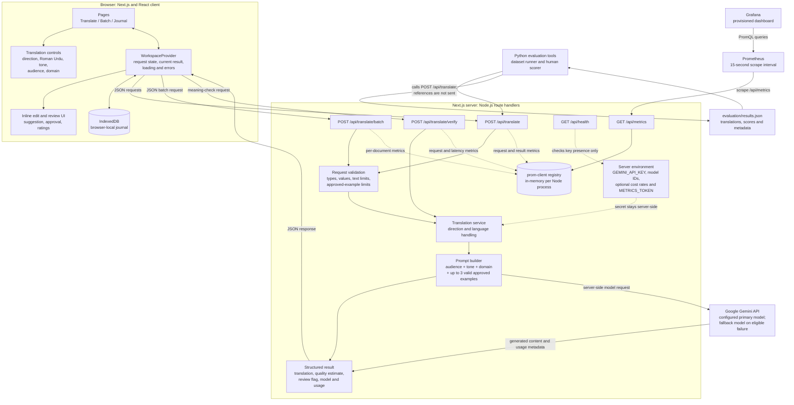
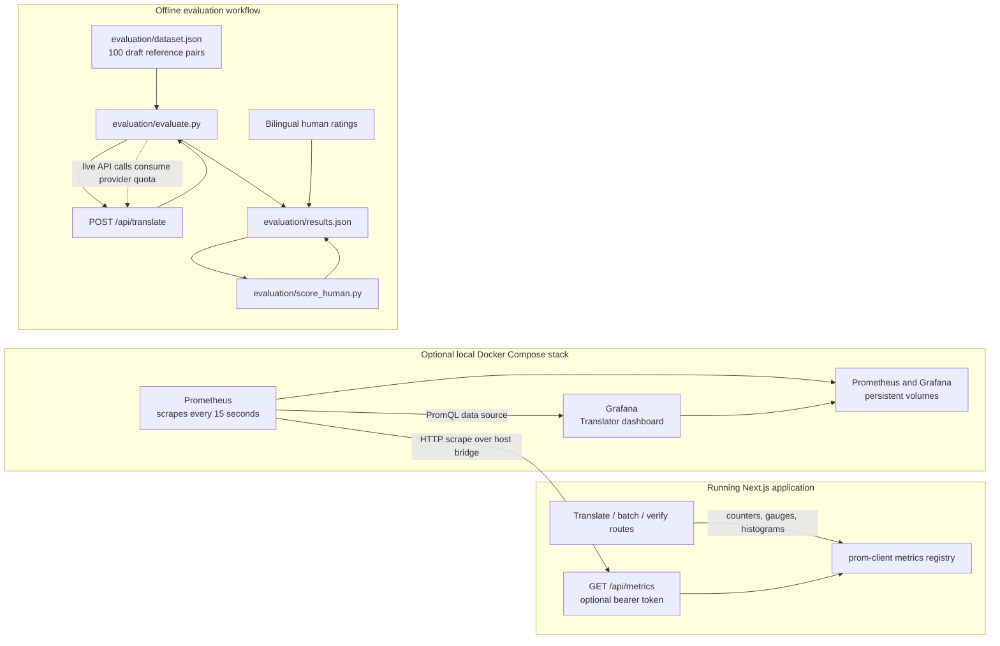

# Lafz Architecture

This document diagrams the implemented Lafz system: browser UI, Next.js server routes, Gemini calls, browser-local review, evaluation tooling, and optional observability. It is a code-oriented view, not a deployment SLA or a claim that planned infrastructure exists.

## System Context



## Translation And Feedback Lifecycle

```mermaid
sequenceDiagram
  autonumber
  actor User
  participant UI as Translate page
  participant State as WorkspaceProvider
  participant DB as Browser IndexedDB
  participant Route as POST /api/translate
  participant Validator as Request validator
  participant Service as Translation service
  participant Gemini as Google Gemini API

  User->>UI: Enter text and choose translation settings
  UI->>State: Submit translation
  State->>DB: Read recent approved, size-valid examples
  DB-->>State: Local journal entries
  State->>Route: JSON text, settings, approved examples
  Route->>Validator: Validate request and example bounds
  Validator-->>Route: Parsed TranslateInput
  Route->>Service: Translate input
  Service->>Service: Detect direction and build prompt
  Service->>Gemini: Generate with configured primary model
  alt Temporary 503 or eligible primary failure
    Gemini-->>Service: Error
    Service->>Service: Retry temporary 503 once; select fallback when eligible
    Service->>Gemini: Generate with fallback model
    Gemini-->>Service: Structured translation and usage metadata
  else Primary succeeds
    Gemini-->>Service: Structured translation and usage metadata
  end
  Service-->>Route: Result and review metadata
  Route-->>State: JSON result
  State->>DB: Save metadata; retain text per user choice
  State-->>UI: Render translation and quality/review details

  opt User submits an inline suggestion
    User->>UI: Edit result and save feedback
    UI->>State: Submit suggestion
    State->>DB: Save source, original output, suggestion; mark pending
    DB-->>State: Saved journal state
    State-->>UI: Show saved/pending feedback state
  end

  opt Reviewer approves a correction
    User->>UI: Add ratings and approve correction in Journal
    UI->>State: Approve journal entry
    State->>DB: Save correction, ratings, approved status
    Note over State,DB: Only approved entries with source <= 500 chars and translation <= 1,000 chars can be reused as prompt examples.
  end
```

Approved examples are selected from the browser-local journal, limited to the three most recent eligible entries, and included in a later request. They are not automatically synchronized, centrally learned, or added to a server-side model. An inline suggestion is pending feedback, not an approved example.

## Telemetry And Evaluation



### Metric families

The dashboard is provisioned from `observability/grafana/dashboards/translator-overview.json`; Prometheus configuration and Grafana datasource/dashboard provisioning live under `observability/`.

| Metric | Type/use |
| --- | --- |
| `translator_http_requests_total` | API request counts by endpoint, method, and status code. |
| `translator_errors_total` | Translation errors by endpoint and provider/error category. |
| `translator_in_flight_requests` | Current in-flight requests by endpoint. |
| `translator_latency_ms` | Latency histogram by endpoint, language direction, and model. |
| `translator_quality_score` | Histogram of model-reported quality estimates by direction and audience. |
| `translator_latency_target_met_total` | Count of translations that met or missed the heuristic latency target. |
| `translator_fallback_model_usage_total` | Fallback model uses. |
| `translator_input_tokens_total`, `translator_output_tokens_total` | Provider-reported token counters when present. |
| `translator_estimated_cost_usd_total` | Estimated cost counter when usage and both configured prices are present. |
| `translator_*` process metrics | Node.js process/runtime metrics collected by `prom-client`. |

Counters and histograms may not have application samples until the corresponding API flow runs successfully. Metrics are process-local and reset when the application process restarts; Prometheus persists scraped samples in its own volume.

## Component Map

| Responsibility | Implementation |
| --- | --- |
| Shared shell and navigation | `src/components/AppShell.tsx` |
| Language, audience, tone, and domain controls | `src/components/TranslationControls.tsx`, `src/lib/audiences.ts` |
| Translation page and inline suggestion editor | `src/app/page.tsx` |
| Batch page | `src/app/batch/page.tsx` |
| Journal, correction approval, and ratings | `src/app/journal/page.tsx`, `src/lib/workspace-context.tsx` |
| Browser-local persistence | `src/lib/localJournal.ts` |
| Request validation and provider error mapping | `src/lib/translateRequest.ts` |
| Prompt construction, Gemini calls, model fallback, result metadata | `src/lib/translation.ts` |
| HTTP handlers | `src/app/api/translate/route.ts`, `src/app/api/translate/batch/route.ts`, `src/app/api/translate/verify/route.ts`, `src/app/api/health/route.ts`, `src/app/api/metrics/route.ts` |
| Metrics registry | `src/lib/metrics.ts` |
| Evaluation runner and human scoring | `evaluation/evaluate.py`, `evaluation/score_human.py` |
| Observability stack and dashboard | `docker-compose.observability.yml`, `observability/` |

## Boundaries And Caveats

- **Secrets:** `GEMINI_API_KEY` is read only by server-side code. The browser never receives it. Keep provider and Grafana credentials out of client code, source control, and public logs.
- **Provider data flow:** Translation source text and any included approved examples are sent to Google Gemini for inference. Browser-local journal storage does not make provider inference local.
- **Local feedback:** IndexedDB is per browser profile/device, has no server backup or account synchronization, and can be deleted by clearing site data. The opt-in setting governs routine source/output retention; explicitly submitting feedback saves the text needed for review.
- **Authentication and abuse controls:** Translation APIs do not currently implement user authentication or per-user rate limiting. Metrics has optional bearer-token protection; that is not API authentication.
- **Health:** `/api/health` reports configuration presence, not key validity, provider connectivity, or quota.
- **Quality:** A model-generated score and back-translation are review aids, not independent accuracy measurements. The evaluation references are AI-assisted drafts pending bilingual human validation; current results are not measured.
- **Deployment:** The documented Prometheus target assumes the app runs on the host at port 3000 and Docker can reach it through `host.docker.internal`. Adjust this for other deployment topologies.
